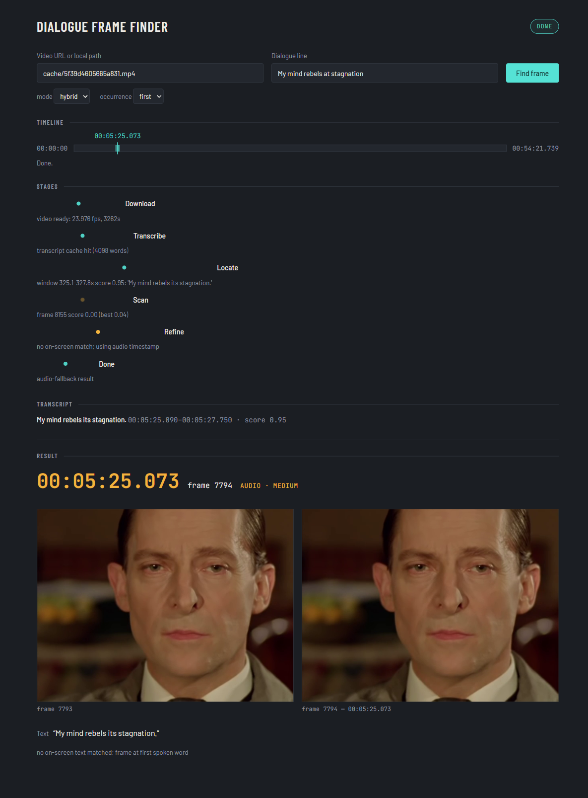

# Dialogue Frame Finder

Given a video URL and a line of dialogue, finds the **first frame** where that dialogue appears on screen.

Status: Plan 1 (pipeline + CLI) and Plan 2 (web UI) both complete — 67 tests passing. The web app is the
primary interface; the CLI underneath is unchanged. See docs/APPROACH.md and docs/DECISIONS.md for the
full story.

## Run the web app

    .\start.ps1     # Windows
    ./start.sh      # macOS/Linux

(Create the venv first if you haven't — see the CLI section below; both scripts check for it and tell
you if it's missing.) The script opens `http://127.0.0.1:8000` in your browser and starts the server in
the foreground; `Ctrl+C` stops it. If Windows blocks `start.ps1` with an execution-policy error, run:
`powershell -ExecutionPolicy Bypass -File start.ps1`.

**GPU (optional):** `pip install -r requirements-gpu.txt` — NVIDIA GPU with a recent driver; falls back
to CPU automatically.

Paste a video URL or a local file path and the line of dialogue, press "Find frame", and watch the
pipeline run live: the stage list ticks through download → transcribe → locate → scan → refine → done,
a timeline bar for the whole video fills in — an amber window where the audio locates the line, teal
ticks where OCR sampled (brighter on hits) — and it ends in a result card: the frame, the frame before
it, timecode, text, and confidence.

The API in five lines:

- `POST /jobs` `{url, text, mode, occurrence}` → `{id}` — starts a job (`url` is a URL or a local path)
- `GET /jobs/{id}` → `{status, result, error}`
- `GET /jobs/{id}/events` → Server-Sent Events, one per pipeline `StageEvent`, replays from `Last-Event-ID`
- `GET /jobs/{id}/frames/{n}.png?w=` → that frame, rendered from the cached video on demand
- `POST /jobs/{id}/cancel` → sets a cancellation flag the pipeline checks between stages

Limitations (demo scope, documented not hidden): single user, jobs live in memory only (gone on restart),
one job runs at a time (CPU-bound OCR/Whisper aren't re-entrant-safe), first run downloads models — see
"How it decides" below.

## CLI (same pipeline)

    py -3.14 -m venv .venv && .venv\Scripts\pip install -r requirements.txt
    cd backend
    ..\.venv\Scripts\python -m dialogue_finder --url "https://ok.ru/video/248244667877" --text "My mind rebels at stagnation" --out ..\output

Output (real run, `--mode hybrid`, this video has no burned-in subtitles so it resolves via audio):

    Timestamp : 00:05:25.073
    Frame     : 7794
    Text      : "My mind rebels its stagnation."
    Confidence: MEDIUM  (source: audio; no on-screen text matched; frame at first spoken word)
    Image     : ..\output\frame_7794.png
    Previous  : ..\output\frame_7793.png  (frame before)

Frame numbers are 0-based. Timestamp is `HH:MM:SS.sss`.

Flags: `--local <file>` (use a local file instead of `--url`), `--mode hybrid|audio|ocr` (default `hybrid`),
`--occurrence first|last|all` (default `first`), `--verbose`/`-v`, `--json`, `--out <dir>` (default `output`).

`--occurrence last|all` ranks matches inside the region that was scanned — the audio window in hybrid
mode; use `--mode ocr` for a whole-video ranking.

First run downloads faster-whisper's `base` model (approximately 150 MB), RapidOCR's models
(approximately 10 MB), and the video
itself. Later runs reuse `cache/` (relative to the working directory — so `backend/cache/` when run from
`backend/`) and skip re-downloading and re-transcribing. Runs CPU-only; a CUDA GPU is used automatically
when available and falls back to CPU on failure (measured — see docs/DECISIONS.md). Measured timings:
see docs/APPROACH.md Phase 3.

## How it decides

- **Where to look:** transcribe the audio (faster-whisper), fuzzy-match the target line against the
  transcript (rapidfuzz), take a window around the best match.
- **Which frame:** binary search on OCR score between the last non-matching and first matching sample —
  3-4 OCR calls, not a linear scan.
- **How text is extracted:** RapidOCR, first on the bottom subtitle band, full-frame if that misses.
- **Ambiguity (repeated lines, gradual appearance):** `--occurrence first|last|all` picks which match to
  report; the `Previous` line is labelled `pop-in` or `fade-in` so a gradual appearance is visible, not
  just asserted.

## How it works (one paragraph)

Audio says *where* (Whisper transcript, fuzzy-matched → a window around the best-scoring line). OCR scans
that window at 5 fps looking for the line on screen; if it misses, one retry scans a widened window
(±15 s) at 2 fps before giving up on OCR. Binary search then finds the exact frame from the OCR score
between the last non-matching and first matching sample. No audio match at all → whole-video OCR at
2 fps instead of a window. No OCR match anywhere → the frame at the first spoken word is returned, with
the transcript words as the text and `MEDIUM` confidence. Always produces a result; never a traceback
(see docs/APPROACH.md Phase 4, never-crash pass).

## Docs

- docs/APPROACH.md — phased design, measurements, limits
- docs/DECISIONS.md — where the human overrode the AI, and why
- docs/BENCHMARK.md — synthetic ground-truth results
- prompts.txt — every AI prompt used, verbatim

## Troubleshooting

- ffmpeg download fails (connection reset): see docs/DECISIONS.md "static-ffmpeg download can fail on some networks".
