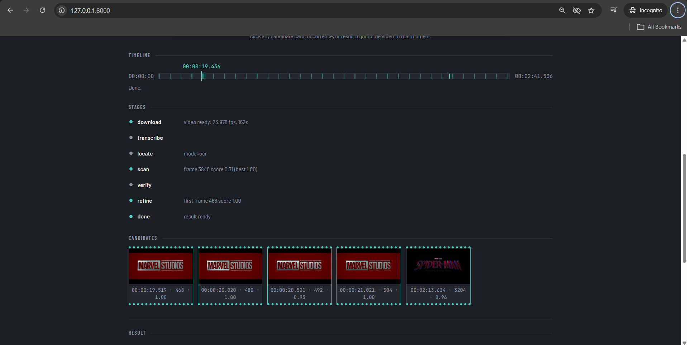
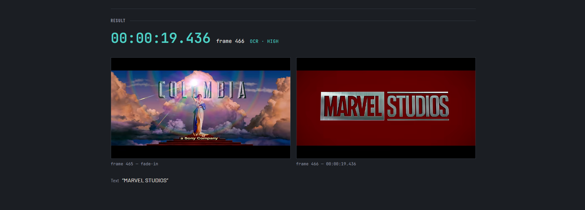
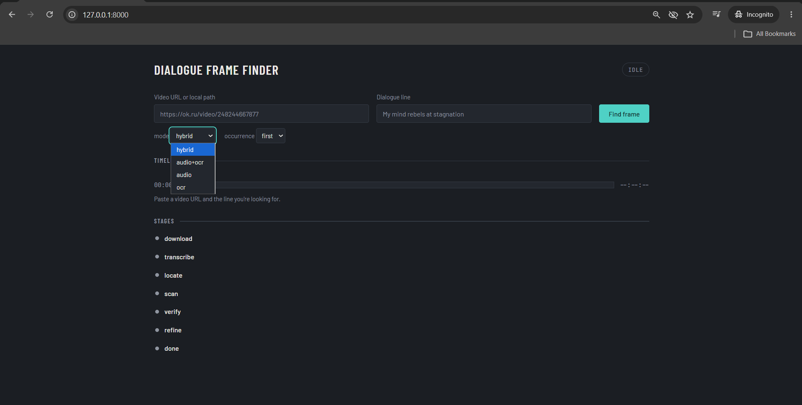
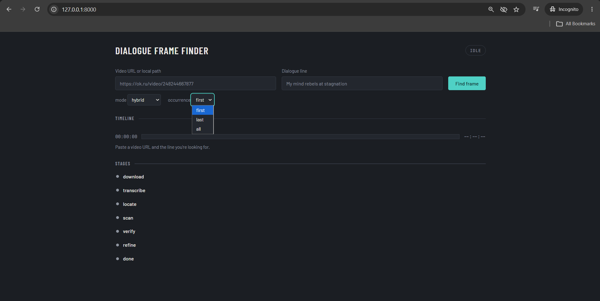
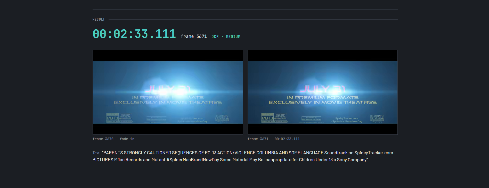
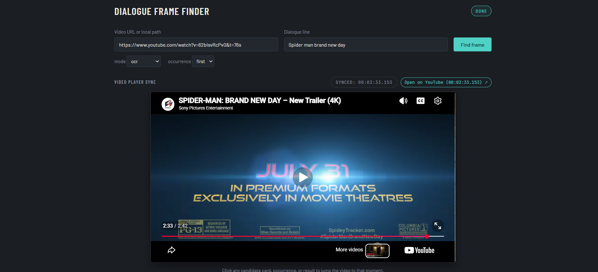
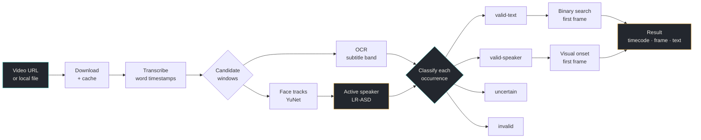

<div align="center">

# Dialogue Frame Finder

**Give it a video and a line of dialogue. It gives you back the exact frame.**


*The answer, with its evidence: the frame before, the frame itself, and the face the model confirmed was speaking.*

</div>

---

## Quick start

```bash
py -3.14 -m venv .venv && .venv\Scripts\pip install -r requirements.txt
.\start.ps1
```

The browser opens at `http://127.0.0.1:8000`. Paste a URL, type a line, press **Find frame**.

> [!TIP]
> **Windows blocks the script?** Run `powershell -ExecutionPolicy Bypass -File start.ps1`.
> **macOS or Linux?** `./start.sh` does the same thing.

> [!NOTE]
> The first run downloads the speech model (~150 MB), the OCR models (~10 MB) and the video itself into `cache/`.
> Every run after that reuses them — a repeat query on the same video takes seconds.

---

## Demos

One recording per mode, on the same trailer. **The previews play by themselves** — click any of them to open the full-length recording.

<!-- demos:start -->

| [](docs/media/demo-hybrid.mp4) | [](docs/media/demo-audio-ocr.mp4) |
|:---:|:---:|
| **`hybrid`** — the full pipeline<br><sub>Audio finds every occurrence, OCR checks for on-screen text, and an active-speaker model checks **whether a visible person is actually saying it**.</sub> | **`audio+ocr`** — locate, then confirm<br><sub>Whisper narrows the search to a few seconds; OCR pins the exact frame where the subtitle appears.</sub> |
| [](docs/media/demo-ocr.mp4) | [](docs/media/demo-audio.mp4) |
| **`ocr`** — on-screen text only<br><sub>No audio at all. Scans frames for the text: title cards, captions, signage.</sub> | **`audio`** — spoken word only<br><sub>Straight to the transcript. The fastest answer when only the spoken moment matters.</sub> |

<!-- demos:end -->

<details>
<summary><b>Enable full video players with controls</b> — one-time, after the repository is pushed</summary>
<br>

GitHub plays a video inline only when the file is served from GitHub's own asset host; a video linked
from the repository downloads instead. To upgrade the four previews into real players with scrubbing
and full resolution:

1. Open any issue on the pushed repository (you do not have to submit it).
2. Drag `docs/media/demo-hybrid.mp4` into the comment box and wait for the upload to finish.
3. Copy the URL GitHub inserts — it looks like `https://github.com/user-attachments/assets/...`.
4. Repeat for the other three, then run:

```bash
.venv\Scripts\python scripts\embed_videos.py ^
  --hybrid    https://github.com/user-attachments/assets/... ^
  --audio-ocr https://github.com/user-attachments/assets/... ^
  --ocr       https://github.com/user-attachments/assets/... ^
  --audio     https://github.com/user-attachments/assets/...
```

The script rewrites the block between the `demos:start` / `demos:end` markers into real
`<video controls>` players. `--reset` puts the GIF previews back.

</details>

---

## Interface

|  |  |
|:---:|:---:|
| **Paste and go** — two fields, one button | **Player sync** — the source video jumps to the moment it found |
|  |  |
| **Live progress** — every stage reports as it runs, with its numbers | **Every candidate, judged** — and why each was accepted or rejected |
|  |  |
| **Filmstrip** — the frames considered, with their scores | **Text extracted** — read straight off the frame |

<details>
<summary><b>More screenshots</b> — mode picker, occurrence picker, title-card detection</summary>
<br>

|  |  |
|:---:|:---:|
| Four modes, one dropdown | first / last / all occurrences |
|  |  |
| Title cards and burned-in text | Result synced back to the source video |

</details>

---

## How it finds the frame



| The hard question | How this answers it |
|---|---|
| **Where do I even look?** | Whisper transcribes once and fuzzy-matching narrows a 54-minute video to a few seconds. No blind frame-by-frame scan. |
| **Which frame exactly?** | Binary search on the OCR score between the last miss and the first hit — three or four reads, not thousands. For a speaker, the frame where the lips start moving. |
| **How is the text extracted?** | RapidOCR on the subtitle band first, full frame if that misses. |
| **What if it is ambiguous?** | Every occurrence is scored and classified, the strongest wins, and the answer always states how it was found and how confident it is. |

Full reasoning, measurements and trade-offs: **[docs/approach_final.md](docs/approach_final.md)**.

---

## Modes

| Mode | What it uses | Best for | Extra install |
|:---|:---|:---|:---|
| **`hybrid`** *(default)* | audio + OCR + active speaker | "Is a real person on screen saying this?" | `requirements-asd.txt` |
| **`audio+ocr`** | audio + OCR | Burned-in subtitles, dubbed films | — |
| **`ocr`** | OCR only | Title cards, signage, silent text | — |
| **`audio`** | transcript only | Fastest spoken-word lookup | — |

Add `--occurrence first | last | all` when the line is said more than once.

> [!NOTE]
> Without the optional extras, `hybrid` does not break — it reports `verify: skipped` and returns the `audio+ocr` answer.

---

## Command line

```bash
cd backend
..\.venv\Scripts\python -m dialogue_finder --url "https://ok.ru/video/248244667877" --text "My mind rebels at stagnation"
```

```text
Timestamp : 00:05:25.365
Frame     : 7801
Text      : "My mind rebels its stagnation."
Confidence: HIGH  (source: audio+asd; on-screen speaker verified (LR-ASD mean 0.89))
Image     : ..\output\frame_7801.png
Previous  : ..\output\frame_7800.png  (frame before)
Occurrence: valid-speaker
Speaker   : 218,0,304,395
```

`--local <file>` · `--mode hybrid|audio+ocr|audio|ocr` · `--occurrence first|last|all` · `--verbose` · `--json` · `--out <dir>`

Frames are 0-based, timestamps are `HH:MM:SS.sss`, and a weak answer is labelled low-confidence rather than presented as certain.

<details>
<summary><b>HTTP API</b> — the same pipeline, five endpoints</summary>

| Method | Endpoint | Purpose |
|---|---|---|
| `POST` | `/jobs` | Start a job — `{url, text, mode, occurrence}` → `{id}` |
| `GET` | `/jobs/{id}` | Status and result |
| `GET` | `/jobs/{id}/events` | Server-Sent Events, one per pipeline stage (resumable) |
| `GET` | `/jobs/{id}/frames/{n}.png` | Any frame, rendered on demand |
| `POST` | `/jobs/{id}/cancel` | Stop a running job |

</details>

---

## Install

<table>
<tr><th align="left" width="30%">Step</th><th align="left">Command</th></tr>
<tr><td><b>1. Environment</b></td><td><code>py -3.14 -m venv .venv</code></td></tr>
<tr><td><b>2. Core</b></td><td><code>.venv\Scripts\pip install -r requirements.txt</code></td></tr>
<tr><td><b>3. Speaker detection</b> <sub>(optional)</sub></td><td><code>.venv\Scripts\pip install -r requirements-asd.txt</code></td></tr>
<tr><td><b>4. GPU</b> <sub>(optional)</sub></td><td><code>.venv\Scripts\pip install -r requirements-gpu.txt</code></td></tr>
<tr><td><b>5. Run</b></td><td><code>.\start.ps1</code></td></tr>
</table>

Everything runs on your machine — no API keys, no cloud, no data leaving the laptop. A CUDA GPU is used automatically when present and falls back to CPU on its own (measured: transcription 48.9 s on GPU versus 141 s on CPU).

<details>
<summary><b>Troubleshooting</b></summary>
<br>

| Symptom | Fix |
|---|---|
| `start.ps1` refuses to run | `powershell -ExecutionPolicy Bypass -File start.ps1` |
| ffmpeg download fails (connection reset) | See `docs/DECISIONS.md` → "static-ffmpeg download can fail on some networks" |
| Speaker-detection models will not download | `curl -L -o cache/models/finetuning_TalkSet.model https://raw.githubusercontent.com/Junhua-Liao/LR-ASD/1b6dcd2d8fc2895683de6508ec6294ec47d388ca/weight/finetuning_TalkSet.model`<br>`curl -L -o cache/models/face_detection_yunet_2023mar.onnx https://media.githubusercontent.com/media/opencv/opencv_zoo/main/models/face_detection_yunet/face_detection_yunet_2023mar.onnx` |
| A run takes minutes | First run on a long video: download plus transcription. Repeat runs hit the cache. |

Model files are SHA-256 verified on every download **and** every load — a mismatch deletes the file and stops rather than loading something tampered with.

</details>

---

## Validation

```bash
cd backend && ..\.venv\Scripts\python -m pytest -q
```

| Check | Result |
|---|---|
| Test suite | **151 passing** |
| Synthetic ground truth, 8 variants | Exact frame on 7 of 8; worst case 1 frame (fade-in) |
| 54-minute episode, `hybrid` | `valid-speaker` · frame 7801 · speaker verified (LR-ASD 0.89) |
| Trailer title card, `ocr` | `valid-text` · frame 466 · text read as *"MARVEL STUDIOS"* |
| Voice-over clip (narrator off screen) | `uncertain` — correctly refuses to claim a visible speaker |
| Bad URL or missing file | One-line error, exit code 1 — never a traceback |

---

## Documentation

| Document | Contents |
|---|---|
| [`docs/approach_final.md`](docs/approach_final.md) · [PDF](docs/approach_final.pdf) | **Start here** — problem, architecture, evidence model, exact-frame selection, decisions, validation, limitations |
| [`docs/APPROACH.md`](docs/APPROACH.md) · [PDF](docs/APPROACH.pdf) | Full engineering log: every phase, measurement and investigation |
| [`docs/DECISIONS.md`](docs/DECISIONS.md) | Every decision and why, including the ones that were overruled |
| [`docs/BENCHMARK.md`](docs/BENCHMARK.md) | Ground-truth accuracy across fonts, positions, fades, resolutions and frame rates |
| [`prompts.txt`](prompts.txt) | Every prompt used to build this, verbatim and in order |

---

## Limitations

- Onset accuracy for a speaking face is about ±0.25 s — stated precision, not a frame-exact claim.
- Profile faces and hard cuts weaken speaker detection; the system reports `uncertain` instead of guessing.
- Demo scope: single user, jobs held in memory, one job at a time.

## Built on

[faster-whisper](https://github.com/SYSTRAN/faster-whisper) · [RapidOCR](https://github.com/RapidAI/RapidOCR) · [LR-ASD](https://github.com/Junhua-Liao/LR-ASD) (MIT) · [OpenCV YuNet](https://github.com/opencv/opencv_zoo) · [yt-dlp](https://github.com/yt-dlp/yt-dlp) · [FastAPI](https://fastapi.tiangolo.com/)
